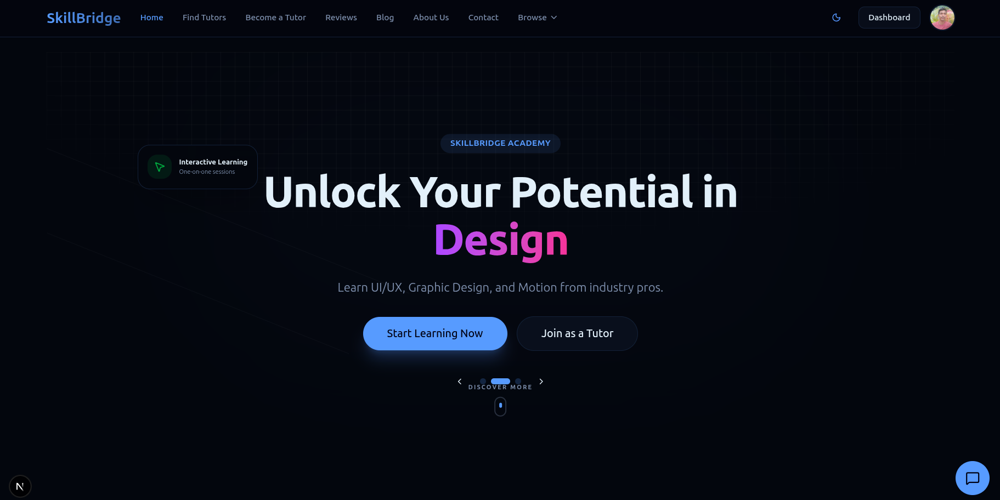
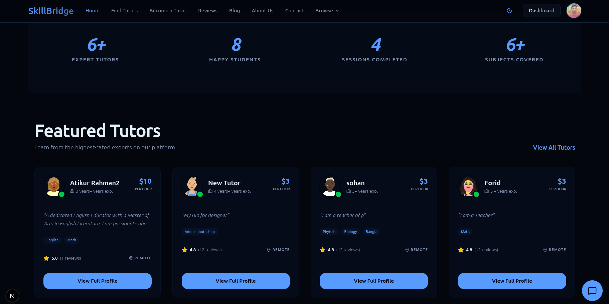
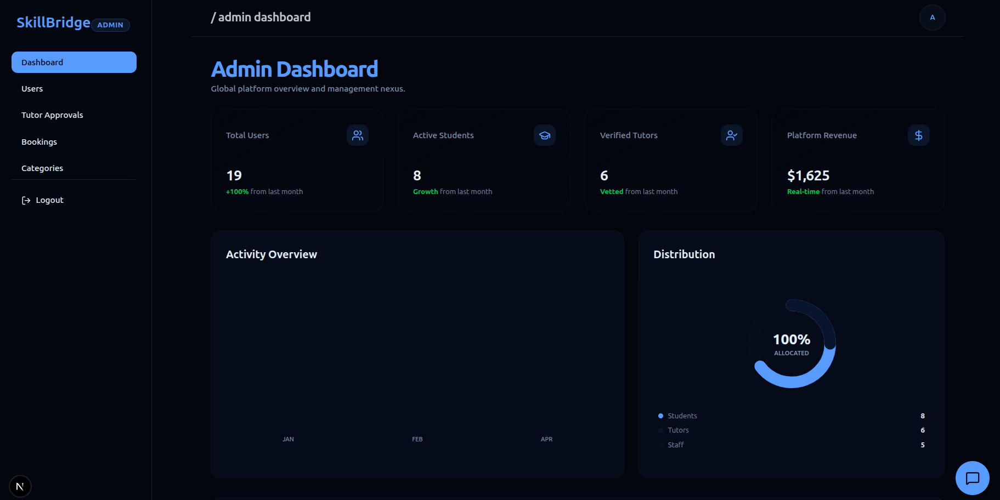

# SkillBridge 🎓

**"Connect with Expert Tutors, Learn Anything"**

SkillBridge is a comprehensive full-stack web application designed to bridge the gap between learners and expert tutors. It facilitates seamless browsing of tutor profiles, instant session booking, and effective management of teaching schedules.

---

## 📸 Visual Preview

### 🏠 Landing Page (Hero)


### 👨‍🏫 Tutor Card


### 📊 Dashboard Overview


---

## 🔗 Important Links

- **🌐 Live Site URL:** [https://assign-4-l2b6-sb-frontend.vercel.app/](https://assign-4-l2b6-sb-frontend.vercel.app/)
- **📄 API Documentation:** [View API Endpoints](./api_end_point.md)
- **📄 Video Demo:** [View Video Demo](https://drive.google.com/file/d/1VxtOKcx3KtuAcC-LaC-ewpPY-6I7DF6G/view?usp=drive_link)

---

## 🔐 Admin Credentials

To access the Admin Dashboard features:

- **Email:** `admin@skillbridge.com`
- **Password:** `admin123`

---

## ✨ Key Features

### 🤖 AI-Powered Intelligence
- **AI Assistant Search:** Advanced search capabilities on the Tutor Selection page to find the perfect match using natural language.
- **AI Tutor Bot:** Interactive AI chatbot available throughout the platform to answer queries and guide users.
- **AI profile Bio Generator:** Smart bio generation tool for tutors to transform rough notes into professional, platform-ready descriptions.

### 🌍 Public & Platform
- **Tutor Discovery:** Browse and search tutors by subject, rating, price, and expertise.
- **Dynamic Platform Stats:** Real-time metrics showing total tutors, active students, and successful sessions.
- **Premium UI/UX:** Fully responsive design with Dark Mode support, glassmorphism effects, and a professional mobile drawer menu.

### 👨‍🎓 Student Features
- **Seamless Booking:** Interactive booking system with real-time availability validation.
- **Reliable Auth:** Hybrid session bridging for Google OAuth and Email login ensuring persistence across Vercel deployments.
- **Feedback System:** Public review and rating system for verified tutoring sessions.

### 👨‍🏫 Tutor Features
- **Professional Profiles:** Comprehensive tools to manage expertise, bio, and educational background.
- **Availability Management:** Granular control over teaching slots and session schedules.
- **Dashboard Monitoring:** Centralized view for managing bookings and student interactions.

### 🛡️ Admin & Analytics
- **User Governance:** Full control over student and tutor accounts, including approval workflows for new tutors.
- **Content Operations:** Manage categories, subjects, and oversee system-wide activities.
- **Insightful Analytics:** Data-driven overview of platform performance and growth.

---

## 🛠️ Tech Stack

- **Frontend:** Next.js 15+ (App Router), React, Tailwind CSS, Lucide React, Sonner (Toast)
- **Backend:** Node.js, Express, TypeScript, Zod (Validation)
- **Database:** PostgreSQL with Prisma ORM
- **Authentication:** Better-Auth (Optimized for Production/Vercel with Dual-Cookie Strategy)
- **AI Integration:** Google Gemini / Custom AI Logic
- **Deployment:** Vercel (Frontend & Backend)

---

## 🚀 Getting Started

1. **Clone the repository frontend:**
   ```bash
   git clone https://github.com/Murad07/assign_4_l2b6_sb_frontend.git
   ```

2. **Clone the repository backend:**
   ```bash
   git clone https://github.com/Murad07/assign_4_L2B6_skillBridge_backend.git
   ```

3. **Install dependencies:**
   ```bash
   npm install
   ```

4. **Run the development server:**
   ```bash
   npm run dev
   ```

5. **Build for production:**
   ```bash
   npm run build
   ```